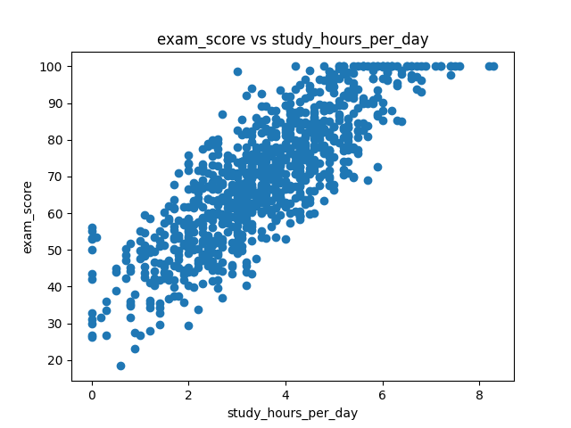

# Draft Manuscript

## Introduction
This paper analyzes a simple dataset for educational purposes.

## Methods
Data was cleaned and plotted using Python scripts.

## Results
Generated plots demonstrate the relationship between x and y.
This is visualized in  Figure 1: 

## Discussion
Discuss reproducibility practices used in this project.